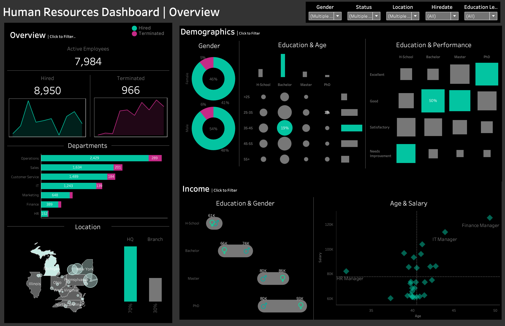

# HR_Analytics_Dashboard - Tableau

Overview of the HR Dashboard Project

This project focuses on delivering a professional-grade HR dashboard that HR managers can use for:
 - Summarizing workforce metrics like hires, terminations, and employee distributions.
 - Analyzing workforce demographics, including gender ratios, education levels, and performance trends.
 - Exploring income insights across departments, education levels, and genders.

Key Features of the Dashboard
Overview Metrics: 
 - A snapshot of employee data over time, including hires and terminations.
 - Demographics Insights: Workforce diversity metrics and performance trends.
 - Income Analysis: Salary comparisons across various categories.
 - Employee Records: Interactive data for granular insights with advanced filtering capabilities.

[Link to the Tableau Public Dashboard](https://public.tableau.com/views/HRAnalytics_17352738497350/HRDashboard?:language=en-US&:sid=&:redirect=auth&:display_count=n&:origin=viz_share_link)

